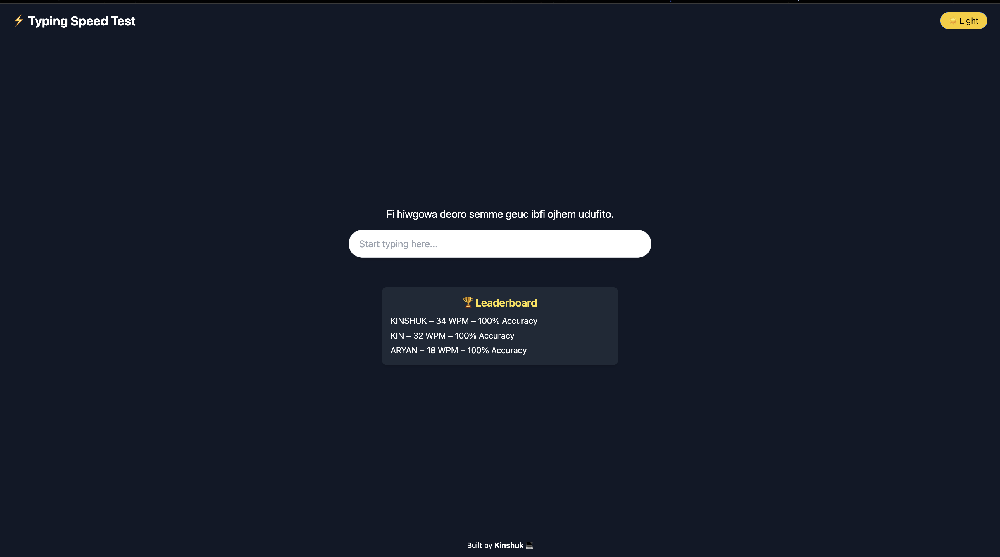

# ⚡ Typing Speed Test

A clean and responsive **Typing Speed Test** web application built using **React** and **Tailwind CSS**.

Test your typing speed and accuracy in real-time, save your scores with initials, and view your top performances on a persistent local leaderboard. 🧠⌨️

---

## 🔥 Features

- 🎯 Real-time WPM and accuracy calculation
- 🧠 Random sentence generation
- 🎨 Light/Dark mode toggle
- 🏆 Local leaderboard with initials
- 📱 Mobile-responsive design
- 🎯 Refresh and retest functionality
- 💻 Built with React + Tailwind CSS

---

## 📸 Preview




---

## 🚀 Getting Started

### 1. Clone the repository

```bash
git clone https://github.com/YOUR_USERNAME/typing-speed-test.git
cd typing-speed-test
```

